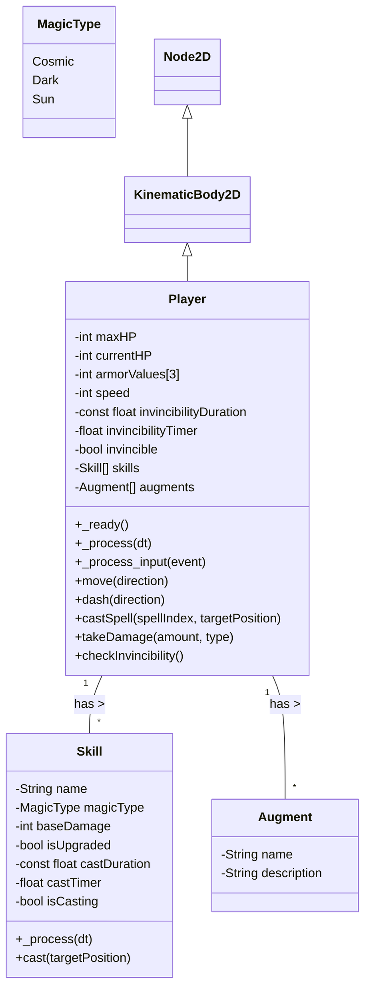
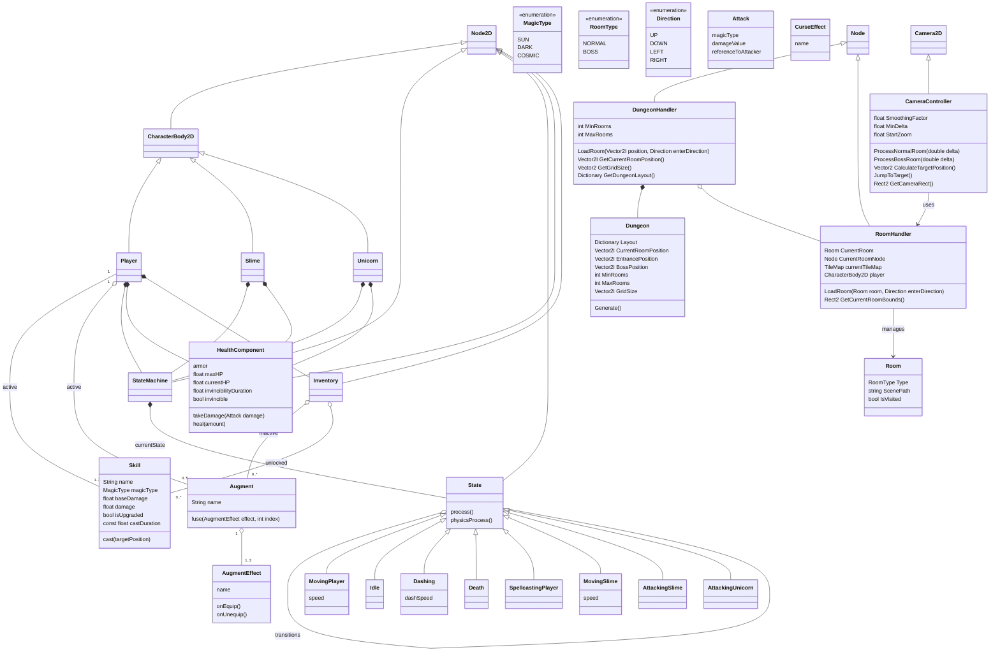
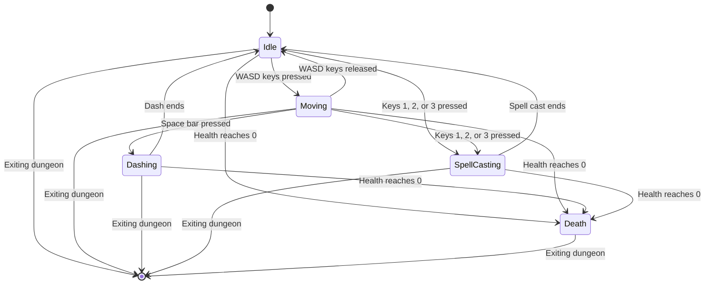
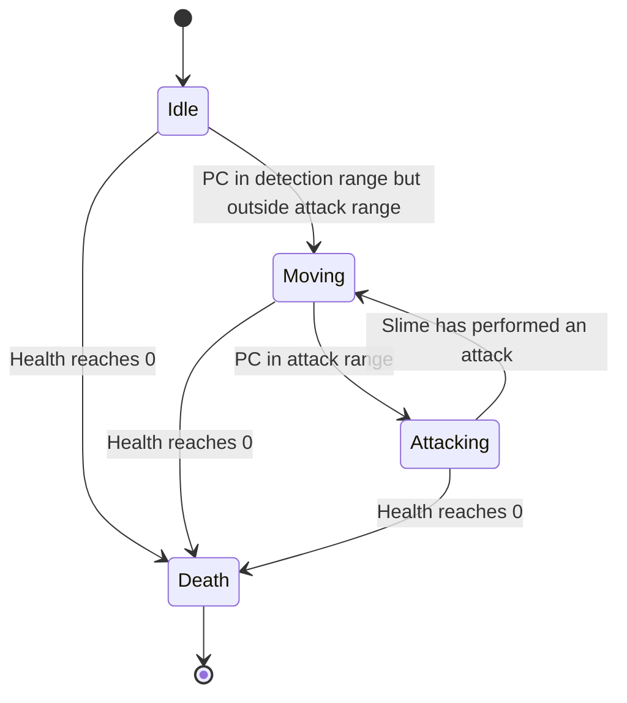
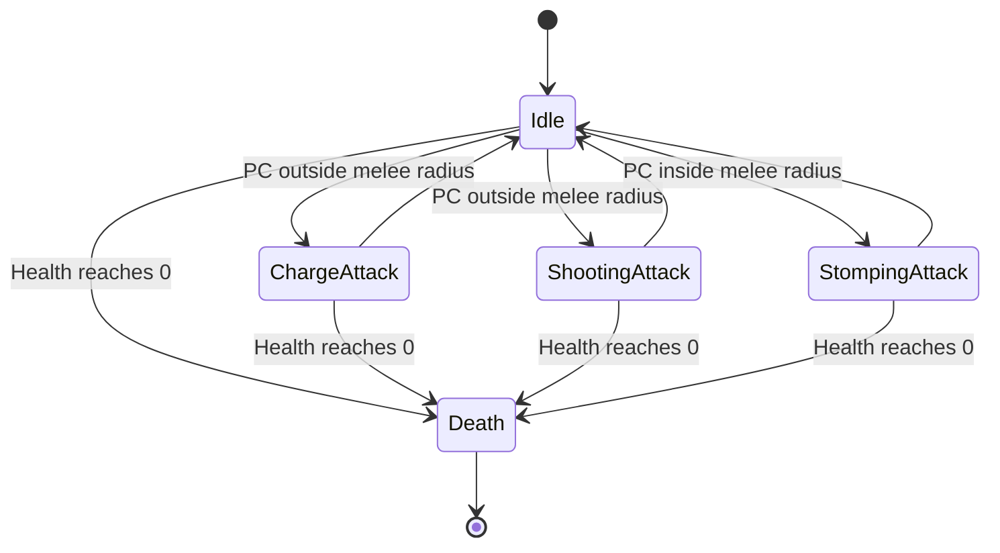

# The Magic Apprentice

# 1. Introduction

## 1.1. Purpose of the system

The purpose of the game is for the player to have fun. 

## 1.2. Scope of the system

The system is a video game developed with Godot 4 that allows the user to control a player character in order to kill monsters in dungeons and to improve their player characters strength through augments and unlocking skills. 

## 1.3. Objectives and success criteria of the project

The goal of this project is the creation of a single player RPG web game.

## 1.4. Definitions, acronyms, and abbreviations

**Player Character (PC)**: This term refers to the character controlled by the player within the game. The player's decisions and actions dictate the character's behavior and progression. 
**Hit Points (HP)**: Represent the health or vitality of entities, such as player characters and enemies. Hit Points decrease when the entity takes damage. An entity is defeated or dies when its Hit Points reach zero. 
**Augment**: A type of item that can be equipped by the player to gain additional statistics or effects. Augments are typically obtained as drops from defeated enemies. 
**Load-out**: The combination of augments and magic skills a player currently equips. A player can equip up to five augments and three magic skills simultaneously.  
**Area of effect (AOE)**: Area in which a damaging skill effects enemies or the PC. 
**Dungeon**: A dungeon is an area within the game where the player can control the Player Character (PC) and combat enemies to gain rewards. Dungeons are composed as a 2D-grid of multiple rooms.

## 1.5. References

We use [Miro Board](https://miro.com/app/board/uXjVKP9G-OI=/?share_link_id=678922601932) for story boards of the game.

An old version can be found on [stormboard](https://stormboard.com/storm/1886510/The_Magic_Apprentice_game)

## 1.6. Overview

# 2. Proposed system

## 2.1. Overview

The PC is a magician that explores dungeons. In these they fight slimes with 3 magic spells to get to the boss room, where they fight a boss.  
There are 2 types of dungeons. Automatically generated ones and story dungeons, that are hand crafted. Furthermore, the player can choose to curse a dungeon, which increases the difficulty by strengthening the enemies or weakening the player. Cursed dungeons give better rewards.
By defeating the boss, the player can unlock new magic skills of the 3 different magic types.

Players also get “augments”, which are used instead of armor. They have between 1 and 3 effects. These effects can be simple stat increases or additional effects (like casting one Skill when another is cast or increasing damaging area).
The player can wear a total of 5 augments at a time. Additional augments can be stored in an inventory. Slots are unlocked by playing story dungeons.

Players can only change their load-out (active augments and spells) outside of dungeons in the home town. This is done since the difficulty of generated dungeons is determined by the amount of augments the player is currently using.
The game is supposed to be finishable in under 2 hours. The idea is hence not to create a long game, but instead allow great replayability by having many different and interesting choices of playstyles and builds.

## 2.2. Functional requirements

### 2.2.1 Entities 

There are two types of entities, the PC and enemies. 

#### 2.2.1.1 Entity properties 

All entities have the following properties: 

| **ID: EP1**| **Entity property: Max HP** |
| --- | --- |
| Description | Every entity has a max HP floating point value that shows how much damage the entity can take before dying. |
| Acceptance Criterion | Has to be implemented |
| Notes | The max HP of every entity has to be greater than 0 and less than infinity. |

| **ID: EP2**| **Entity property: Current HP** |
| --- | --- |
| Description | Every entity has a current HP floating point value that shows how much damage the entity has already taken and can still take before dying. If the current HP value is smaller or equal to zero, the entity dies. |
| Acceptance Criterion | Has to be implemented |
| Notes | The relation of current HP to max HP should be visible for the player for all entities on screen through healthbars.   The current HP always has to be less or equal to the max HP. Contrary to the max HP it is allowed to be negative. |

| **ID: EP3**| **Entity property: Armor values** |
| --- | --- |
| Description | Every entity has three armor floating point values for each of the three magic types in game. The armor type for a magic type determines how much the damage to the entity is reduced by an attack of that magic type (30 armor means 30% damage reduction).   If an entity has an armor value above 100, part of the damage is reflected back to the attacker. Example: Entity has 120 armor, attack makes 100 damage, then 20 damage is reflected back to the attacker, if the attacker has an armor value of 50, the attacker takes 10 damage. |
| Acceptance Criterion | Damage of all types is applied correctly to entities depending on their armor values. |
| Notes | The damage calculation works like   if armor <= 100: health = health - damage*(100-armor)/100   Only PC should be able to reach over 100 armor through additional stats, enemies need at least one armor value below 30 unless they are buffed.   Case where both entities have over 100 armor of the same type has to be covered nonetheless. In that case both entites take no damage of this magic type. |

| **ID: EP4**| **Entity property: Damaging skills** |
| --- | --- |
| Description | Every entity has one or more damaging skills. Every skill has a magic type and a base damage floating point value. The base damage value can be modified under certain circumstances (curses for enemies, augments and buffing skill for the PC). A damaging skill only damages the opponent, that means the PC takes no damage from their own spells and enemy attacks only damage the PC. |
| Acceptance Criterion | Damage from different skills of all magic types is applied correctly to PC and enemies for armor values of 0. |
| Notes | The area in which a damaging skill applies damage to the opponent and the duration in which the opponent takes damage depends on the specific skill. |

| **ID: EP5**| **Entity property: Speed** |
| --- | --- |
| Description | Every entity has a speed floating point value that determines how quickly it can move across the game environment. This affects both the player character (PC) and enemies. |
| Acceptance Criterion | Speed should be accurately reflected in the movement rate of entities in the game. |
| Notes | Speed may be modified by certain augments or dungeon curses. |

| **ID: EP6**| **Entity property: Invincibility Time** |
| --- | --- |
| Description | After taking damage, an entity becomes invincible for a short duration during which it cannot take further damage. This is to prevent rapid successive damage from multiple sources. |
| Acceptance Criterion | Invincibility time is correctly applied after each instance of damage. |
| Notes | The duration of invincibility should be short and consistent across all entities unless modified by specific augments or dungeon curses.   The invincibility time has to be between 0 and 10 seconds. |

#### 2.2.1.2 Magic types 

There are three magic types in the game: Sun, Cosmic and Dark. Skills and enemies belonging to the different magic types are colour coded to allow differentiation by the player. The colours are Sun: yellow - red, Cosmic: blue - white, Dark: black - purple. The magic types work like in Rock, paper, scissors such that they have one other magic type that they are strong against and one against which they are weak. Their effectivity against themselves is in between.  
The magic types are:
- Sun, strong against Cosmic, weak against Dark
- Cosmic, strong against Dark, weak against Sun
- Dark, strong against Sun, weak against Cosmic

#### 2.2.1.3 Player character (PC)

The PC is the figure the player controls while playing the game. The PC is a wizard and should wear therefore wizard-like clothing, e.g., a pointy hat, a long robe and a staff.

##### 2.2.1.3.1 PC control

The PC is controled by the player via keyboard and mouse movements. 
A visualization of the state machine can be found [here](#2533-state-machines).
The PC has five states which are described in the following. 

The PC starts in the **Idle** state.

| **ID: EPC1**| **PC state: Idle** |
| --- | --- |
| Description | If the player does not press the buttons relevant for movement, spellcasting or dashing, the PC remains idle and does not move. The idle animation specified in the sprite sheet is shown. |
| Acceptance Criterion | PC is in idle state if no input is given. |
| Notes | None |

| **ID: EPC2**| **PC state: Moving** |
| --- | --- |
| Description | If the player uses the `WASD` keys, the PC moves as long as the keys are pressed. The specific walking animation for each direction from the sprite sheet is shown. |
| Acceptance Criterion | PC walks correctly if WASD is given as input. |
| Notes | In order to get the direction of movement, the key `W` is mapped to the vector $(0, -1)$ (note that Godot uses inverted y-Axis), `A` to $(-1, 0)$, `S` to $(0, 1)$, `D` to $(1, 0)$. Then all vectors for which the buttons are pressed are added up and the result is then normalized to give the direction vector.   The speed of movement has to be greater than 0 and less than the speed of light. |

| **ID: EPC3**| **PC state: Dashing** |
| --- | --- |
| Description | If the player presses the space bar while inside **Idle** or **Moving** state, the PC moves with increased speed in the direction of the current movement for a predefined length. While dashing, the player cannot be hit. |
| Acceptance Criterion | PC dashes in the correct direction when the space bar is pressed. |
| Notes | The dashing speed has to be at least 20% greater then movement speed, but less than light speed. |

| **ID: EPC4**| **PC state: SpellCasting** |
| --- | --- |
| Description | If the player presses one of the spellcasting keys 1, 2 or 3 while inside **Idle** or **Moving** state, the PC casts a spell/uses a [PC skill](#221321-pc-skills) and the spell casting animation from the sprite sheet is shown. All PC skills get the current position of the PC and the position of the mouse as values to be used.  |
| Acceptance Criterion | PC is in SpellCasting state if input 1, 2 and 3 is given. |
| Notes | Only one spell can be cast at a time.   All skills use the same spell cast animation. Cast times should generally be short (less than 1 second). Slower cast times are achieved by playing the spell cast animation slower. |

| **ID: EPC5**| **PC state: Death** |
| --- | --- |
| Description | When the PC's health reaches 0, they transition to a death state. The player is informed about the PC's death before returning to the main hub. |
| Acceptance Criterion | The PC must correctly transition to the death state when its health is depleted and the player can no longer control the PC's actions. |
| Notes | After the death animation of the PC, a death screen should be shown. |

##### 2.2.1.3.2 PC progression

While playing the game, the player can unlock new skills. The player also unlocks additional augment slots to equip up to 5 augments for additional effects when casting PC skills or increased stats. 

###### 2.2.1.3.2.1 PC skills

Every PC skill belongs to one magic type and does damage of that magic type. 
Each magic type has three different skills: a basic skill, a supportive skill and an offensive skill.
All nine skills have upgraded versions, which are automatically unlocked when the player fulfills a predefined criteria. 
The PC can have up to three different skills equipped.  

Each skill has a damage, magic type, a duration for how long it lasts and a cooldown.

| **ID: EPS1**| **Skill: Basic Skills** |
| --- | --- |
| Description | Each magic type has a basic skill that consist of a colored circular projectile shot from PC in the direction of the mouse. If the projectile hits an enemy, the enemy is dealt the damage of the skill and the projectile despawns.   If the projectile hits a wall or structure it also despawns. |
| Acceptance Criterion | Has to be implemented |
| Notes | The color of the projectile is the color of the magic type it belongs to. |

| **ID: EPS2**| **Skill: Sun Beam** |
| --- | --- |
| Description | The supportive skill of the sun magic type. The PC emits a ray of yellow ligth from the PC in the direction of the mouse.   Enemies hit deal reduced damage and have reduced armor until they are killed. |
| Acceptance Criterion | Has to be implemented |
| Notes | None |

| **ID: EPS3**| **Skill: Summon Sun** |
| --- | --- |
| Description | PC spawns a yellow circular object that looks like a sun at the mouse location that lasts for a few seconds. Enemies close to it take damage depending on how close they are to the center. The closer they are, the more damage they take. Enemies take damage at predefined intervals as long as they are inside the AOE.|
| Acceptance Criterion | Has to be implemented |
| Notes | None |

| **ID: EPS4**| **Skill: Moon Light** |
| --- | --- |
| Description | A visualization of a light silver ray of moonlight is shown around the PC. The PC now has increased attack damage for all their equipped skills and increased armor values for all magic types for a few seconds. |
| Acceptance Criterion | Has to be implemented |
| Notes | None |

| **ID: EPS5**| **Skill: Star Rain** |
| --- | --- |
| Description | Multiple blue circular projectiles spawn randomly around the PC and start moving towards the mouse position.   On collision with enemy they apply their damage and despawn. On collision with a wall or structure they despawn. |
| Acceptance Criterion | Has to be implemented |
| Notes | None |

| **ID: EPS6**| **Skill: Dark Energy Wave** |
| --- | --- |
| Description | PC creates a black wave centered around the PC, moving away from them with predefined speed, that pushes all enemies away from the PC by a predefined distance. The wave pushes away all enemies in the same room as the PC, independently of the distance to the PC. |
| Acceptance Criterion | Has to be implemented |
| Notes | None |

| **ID: EPS7**| **Skill: Black Hole** |
| --- | --- |
| Description | PC creates a round black circular shape at mouse position that pulls all enemies towards it using gravity, if they hit the black circle the enemies take damage. |
| Acceptance Criterion | Has to be implemented |
| Notes | None |

###### 2.2.1.3.2.2 Augments 

Instead of a traditional armor and weapon system, the game uses augments to enhance the PC by giving additional effects and stats. 
A maximum of 5 augment slots can be unlocked, with each augment being equipable to any unlocked slot.
This feature will facilitate the player's ability to craft their own unique builds.   

| **ID: EPA1**| **Augments: Equipping augments** |
| --- | --- |
| Description | The player can equip augments to their unlocked augment slots. Every augment can only be equipped to one slot at a time. The augment effects are then applied to the PC. |
| Acceptance Criterion | Augments can be equipped and the effects are applied to the PC correctly. |
| Notes | None |

| **ID: EPA2**| **Augments: Unlocking augment slots** |
| --- | --- |
| Description | When the player completes the intro dungeon, the first augment slot is unlocked.   When the player clears each further story dungeon, one additional augment slot is unlocked. There are a total of 5 augment slots maximally. |
| Acceptance Criterion | Augment slots are unlocked correctly. |
| Notes | None |

| **ID: EPA3**| **Augments: Obtaining augments** |
| --- | --- |
| Description | When the PC kills an enemy there is a chance to obtain an augment. Slimes have a low chance of dropping augments and are more likely to drop low quality augments. Bosses are guaranteed to drop one augments and have a chance to drop a second augment in not-cursed dungeons. Augments dropped by bosses also have a higher chance to be high quality augments. If an enemy drops an augment, the PC obtains the augment automatically. |
| Acceptance Criterion | Enemies drop augments with the correct chances and the PC obtains the augments when they are dropped. |
| Notes | Every enemy has a chance bigger than zero to drop every possible existing augment. |

Each augment will have 1, 2 or 3 effects. Augments can the same effect several times in which case the effect will stack. The amount of effects determines the quality of the augment. The effects are decided randomly from the list of possible effects by the game when the augment is dropped. The effects will have percentage values. This means that effects of the same type will stack multiplicative.   

To allow build crafting for the player, it is possible to destroy one augment and to move one of its effects onto another augment, overwriting one of its previous effects. This is described in more detail in chapter 2.2.2.1.3 Fusing augments.

##### List of augment effects

The effects of the augments are the following: 

- 10 additional armor of a type
- 5 additional armor of all types
- 10% more hp
- 10% extra damage for one skill (one for each damaging ability)
- 5% extra damage for one magic type
- 1% life steal
- 10% bigger radius for one skill (exists for “summon sun”, “black hole”)
- 10% more stars for “star rain”
- Upon casting spell x also cast spell y (specific spells will be determined during balancing)
- Spell x explodes on impact with enemy (for directional skills only, means damage is applied to all enemies in an AOE)
- Plus 10 attack for all spells of one magic type (this way supportive spells can also deal damage)
- 50% longer duration for skills that remain on field (“summon sun” and/or “black hole”) 
- Plus 20 attack for skill in slot 1/2/3 

Values and effects might have to be changed, added or removed for good balancing later.

#### 2.2.1.4 Enemies

Each Enemy only deals damage of one magic type. It will have a high armor against the damage type that it is strong against and a low armor against the type that it should be weak against. Its armor value against its own magic type is in between. 
Use color coding to signal the magic type of the enemy to the player.

There are two types of enemies:
1. Slimes (small and big, melee and ranged)
2. Unicorn bosses

Enemies are controlled via their state machine.
Most will deal only melee damage. Hence they will track the PC and once they are close attack them.
Slimes will come in large groups. Group behavior is used to simulate better movement so not all of them stand on top of each other, but instead keep distance from one another.

##### 2.2.1.4.1 Slimes

Each slime is associated with a specific magic type. They are visually represented by the color corresponding to their magic type. Slimes only inflict damage aligned with their magic type, and their armor is strong against the magic type that their magic type is strong against and weak against the magic type that their magic type is weak against. The armor against their own magic type is inbetween. 
Example: A Sun slime could have the following armor values: Sun armor: 30, Cosmic armor: 50, Dark armor: 10 (values might change).

Slimes can have four possible states.
The slime always starts in the **Idle** state.

| **ID: ES1**| **Slime states: Idle** |
| --- | --- |
| Description | If the PC is outside of the detection range of the slime, the slime is idle. It changes between two behaviours, first it remains in one position for a random time period of up to 5 seconds and afterwards it moves on a straight line into a random direction for a random time period of up to 5 seconds. This behaviour loops until the slime either dies (enters **Death** state) or gets close enough to the player that it changes to **Moving** or **Attacking** state. The idle animation and the moving animation used in this state are in the slimes sprite sheet and depend on the slimes magic type, attack range and size. |
| Acceptance Criterion | If the PC is outside of the view range of the slime, the slime behaves like described. |
| Notes | None |

| **ID: ES2**| **Slime states: Moving** |
| --- | --- |
| Description | If the PC is inside of the view range of the slime but outside of the attack range of the slime, the slime moves towards the PC until it is in attack range. If the PC is inside the attack range of the slime, the slime transitions to the **Attacking** state. If the PC moves out of the view range of the slime (e.g. by dashing), the slime returns to the **Idle** state. If the slimes health points reach zero, the slime enters the **Death** state. While in the Moving state, a moving animation is played. The moving animation used in this state is in the slimes sprite sheet and depends on the slimes magic type, attack range and size. |
| Acceptance Criterion | The slime moves towards the PC while the PC is in the slimes view range but not inside of its attack range. |
| Notes | None |

| **ID: ES3**| **Slime states: Attacking** |
| --- | --- |
| Description | If the PC is inside of the attack range of the slime, the slime attacks the PC. After the attack is completed, the slime returns to the **Moving** state. If the slimes health points reach zero, the slime enters the **Death** state. While in the Attacking state, an attacking animation is played. The attack animation used in this state is in the slimes sprite sheet and depends on the slimes magic type, attack range and size. |
| Acceptance Criterion | IF the PC is inside the attack range of the slime, the slime attacks the PC. |
| Notes | None |

| **ID: ES4**| **Slime states: Death** |
| --- | --- |
| Description | When the slime's health reaches 0, it transitions to the death state. In this state, the slime stops all actions and does no longer interact with other game objects, and after a short delay in which the death animation is played, it disappears from the game world. The death animation used in this state is in the slimes sprite sheet and depend on the slimes magic type, attack range and size. |
| Acceptance Criterion | The slime must correctly transition to the death state when its health is depleted, and it should no longer be able to perform any actions or affect the game. |
| Notes | Ensure that the transition to the death state is smooth and that the slime's disappearance is visually clear to the player. |

Slimes can differ in three attributes. Apart from the three magic types, there are large and small slimes and there are melee and ranged slimes, making a total of 4 different slime types for each magic type. 
Large slimes have more HP and higher attack values than small slimes. Large slimes are rarer than small slimes and only appear in small groups of up to 3 large slimes. They are often accompanied by several small slimes. 
Ranged slimes have a larger attack range and have a different color brightness than melee slimes. 
The armor values of all slimes of one magic type are the same.

| **ID: ES5**| **Slime types: Melee Slime** |
| --- | --- |
| Description | Melee slimes move towards the PC and once they are very close to the PC, they jump to the position of the PC for their attack. They deal damage to the PC if they collide with the PC during their attack.   Melee slimes can be large or small.   Melee slimes can be differentiated from ranged slimes by a difference in color brightness. Melee slimes have a brighter colour than ranged slimes. |
| Acceptance Criterion | Slimes exist that can attack and damage the player as described and are visually distinct from ranged slimes. |
| Notes | None |

| **ID: ES6**| **Slime types: Ranged Slime** |
| --- | --- |
| Description | Ranged slimes have a larger attack radius. When attacking, they shoot a small projectile from their position in the direction the PC is currently located. The projectile flies on a straight line until it hits either the PC or an object that has at least medium height (e.g. a wall, a stack of boxes, etc., objects that would not qualify are small things that lie on the ground)   Ranged slimes can be large or small.   Ranged slimes can be differentiated from melee slimes by a difference in color brightness. Ranged slimes have a darker colour than melee slimes. |
| Acceptance Criterion | Slimes exist that can attack and damage the player as described and are visually distinct from melee slimes. |
| Notes | None |

| **ID: ES7**| **Slime types: Small Slime** |
| --- | --- |
| Description | Small slimes are the default slime type. Depending on their type, they show the attributes described in the other requirements.   Small slimes can be melee or ranged. |
| Acceptance Criterion | Small slimes can be created. |
| Notes | None |

| **ID: ES8**| **Slime types: Large Slime** |
| --- | --- |
| Description | Large slimes are larger than small slimes and have more HP and larger attack values than small slimes.   Large slimes can be ranged or melee. |
| Acceptance Criterion | Large slimes can be created and they have more HP and larger attack values. |
| Notes | Large slimes should be rarer than small slimes and only appear in small groups of up to 3 large slimes. They should often accompanied by several small slimes. |

| **ID: ES9**| **Slime types: Sun, cosmic and dark Slime** |
| --- | --- |
| Description | All slimes have one of the three magic types: sun, cosmic or dark. All attacks of a slime deal damage of the magic type the slime belongs to. The slimes magic type is indicated to the player by the colour of the slime. Sun slimes are yellow to red, cosmic slimes are blue to white and dark slimes are purple to black. The magic type of a slime determines its armor values against the different magic types. All slimes of a magic type (melee and ranged, small and large) have the same armor values for all magic types unless the armor values are changed by a curse or a PC skill. |
| Acceptance Criterion | Slimes of all three magic types can be created and they only deal damage aligned with the magic type they belong to. |
| Notes | None |

##### 2.2.1.4.2 Bosses

The unicorn is the boss monster of the dungeons. It looks like a unicorn but is coloured according to its magic type.  
Unicorns have no attack and detection range since they can detect and attack the player from every position in the room. Unicorns have three different attacks. Unicorns have a melee attack radius. If the PC is inside of the melee attack radius, the unicorn uses the melee attack, otherwise it uses one of the ranged attacks at random.   
In between two attacks the unicorn remains idle for a short while to allow the player to attack the unicorn with their skills.  
The unicorns are controlled by a state machine. The initial state of the state machine is the **Wait** state. 

| **ID: EB1**| **Unicorn** |
| --- | --- |
| Description | Unicorns are the boss monsters of the dungeons and are in the last room of the dungeon. There are three different types of unicorns, one for each of the three magic types. Unicorns have no detection range or attack range. They can detect and attack the PC from any position when they are in the same room. |
| Acceptance Criterion | Has to be implemented |
| Notes | None |

| **ID: EB2**| **Unicorn states: Wait** |
| --- | --- |
| Description | The Wait state is the initial state of the unicorn. The unicorn remains in the wait state for a short while, for something between 1 and 5 seconds (has to be tested out to see what works well). While in the wait state, the unicorn moves towards the position of the player slowly (speed is greatly reduced).   At the end of the wait state, the unicorn transitions to one of its attacks, depending on how far the PC is away from the unicorn. If the PC is inisde of the melee attack range of the unicorn, the unicorn does a **Stomping attack**. If the PC is outside of the melee attack range of the unicorn, the unicorn either does a **Charge attack** or a **Shooting attack**. A random number is generated to determine which of the two ranged attacks is choosen.   If the unicorns health points reach zero, the unicorn enters the **Death** state.   The walking animation used in this state is in the unicorn sprite sheet and depends on the unicorns magic type. The walking animation shown depends on the direction from the unicorn position to the PC position. There are eight walking animations: up, down, left, right and the four diagonal directions upleft, upright, downleft and downright. If the unicorn walks to the right, the animation right has to be played etc. |
| Acceptance Criterion | Unicorn correctly transitions to the wait state after every attack and remains in the wait state for the designed time duration. The correct walking animation is shown depending on the direction from the unicorn position to the PC position. |
| Notes | None |

| **ID: EB3**| **Unicorn states: Charge attack** |
| --- | --- |
| Description | The unicorn can perform a charged attack, if the PC is outside of the melee attack radius of the unicorn. The unicorn charges with a high speed from its original position in the direction of the PC. The charge ends a distance behind the player. The unicorn has a minimum charge distance that is only shortened if the unicorn charges against a wall. The charge distance of the unicorn can be prolonged if the player would otherwise not be reached by the unicorn. If the unicorn hits the PC, it deals a large amount of damage to the player.   After the attack is completed, the unicorn returns to the **Wait** state.   If the unicorns health points reach zero, the unicorn enters the **Death** state.   The charging animation used in this state is in the unicorn sprite sheet and depends on the unicorns magic type. The charging animation shown depends on the direction from the unicorn position to the PC position. There are eight charging animations: up, down, left, right and the four diagonal directions upleft, upright, downleft and downright. If the unicorn charges to the right, the animation right has to be played etc. |
| Acceptance Criterion | The unicorn charges correctly at the PC. The charging distance is always at least as long as the distance between the unicorn and the PC at the beginning of the charge. The correct charging animation is shown depending on the direction from the unicorn position to the PC position. |
| Notes | None |

| **ID: EB4**| **Unicorn states: Shooting attack** |
| --- | --- |
| Description | The unicorn can shoot a set of projectiles at the PC, if the PC is outside of the melee radius of the unicorn. The projectiles fly away from the unicorn in a random direction in the half plane directed towards the player for a short distance. Afterwards they are accelerated in the direction of the PC position, that the PC has at the begin of the acceleration. The projectiles disappear if they either hit the PC or a wall or a tall object. The unicorn transitions to the **Wait** state, once its shooting animation is finished. This can before the projectiles shoot by the unicorn disappear.   If the unicorns health points reach zero, the unicorn enters the **Death** state.   The shooting animation used in this state is in the unicorn sprite sheet and depends on the unicorns magic type. The shooting animation shown depends on the direction from the unicorn position to the PC position. There are eight shooting animations: up, down, left, right and the four diagonal directions upleft, upright, downleft and downright. If the unicorn shoots to the right, the animation right has to be played etc.  |
| Acceptance Criterion | The projectiles show the described behaviour. The correct charging animation is shown depending on the direction from the unicorn position to the PC position. |
| Notes | None |

| **ID: EB5**| **Unicorn states: Stomping attack** |
| --- | --- |
| Description | If the PC is inside of the melee attack range of the unicorn, the unicorn uses a stomping attack. The unicorn stomps on the ground in front of it, creating an AOE that deals damage to the PC if they are within it. The AOE has two zones, so that the the player receives more damage in a small radius around the unicorn and less damage if they are outside of the area. The unicorn transitions to the **Wait** state, once its stomping animation is finished.   If the unicorns health points reach zero, the unicorn enters the **Death** state.   The stomping animation used in this state is in the unicorn sprite sheet and depends on the unicorns magic type. The stomping animation shown depends on the direction from the unicorn position to the PC position. There are eight stomping animations: up, down, left, right and the four diagonal directions upleft, upright, downleft and downright. If the unicorn shoots to the right, the animation right has to be played etc. |
| Acceptance Criterion | The stomping attack applies damage as described. The correct stomping animation is shown depending on the direction from the unicorn position to the PC position. |
| Notes | None |

| **ID: EB6**| **Unicorn states: Death** |
| --- | --- |
| Description | When the unicorn's health reaches 0, it transitions to the death state. In this state, the unicorn stops all actions and animations, and after a short delay, it disappears from the game world. The death animation used in this state is in the unicorn sprite sheet and depends on the unicorns magic type. |
| Acceptance Criterion | The unicorn must correctly transition to the death state when its health is depleted, and it should no longer be able to perform any actions or affect the game. |
| Notes | Ensure that the transition to the death state is smooth and that the unicorn's disappearance is visually clear to the player.   Find out, whether death animations for several directions are necessary or if one animation looks good enough. |

### 2.2.2 Areas

#### 2.2.2.1 Main Hub 

The first area type is the main hub which is a menu that allows the player to modify their load-out. In this area no PC exists that can be moved. Instead there is a point-and-click visualisation of the magic school. Clicking on specific objects in the image opens the different menus needed to modify the load-out. 

| **ID: AMH1**| **Main Hub** |
| --- | --- |
| Description | The Main Hub is a point nd click environment that allows the player to return back to the main menu and to access four sub menus: the augment inventory, the skill tree, the fuse augments menu and the dungeon selection menu. The graphic for the background and the five buttons is given in the assets folder. |
| Acceptance Criterion | The Main Hub menu exists and connections to the main menu and the four sub-menus via the five buttons work. |
| Notes | None |

##### 2.2.2.1.1 Skill tree

The skill tree is a menu where the player can unlock new skills and read the effects of the different skills. 
Each magic type has its own small skill tree. The base skill is the first skill of each skill tree. The supportive and offensive skills are the second layer of the skill trees. After the base skill is unlocked, the player can decide whether they want to unlock the supportive or offensive skill first.  
For description of the skill see section 2.2.1.3.2.1 PC skills.

| **ID: AST1**| **Skill tree: Unlocking the first skill** |
| --- | --- |
| Description | The player chooses a magic type in the beginning of the game which unlocks that magic types base skill. |
| Acceptance Criterion | The correct base skills are unlocked after the player selects their magic type. |
| Notes | None |

| **ID: AST2**| **Skill tree: Unlocking criteria** |
| --- | --- |
| Description | The base skill of each magic type has to be unlocked before other skills of that magic type can be unlocked. |
| Acceptance Criterion | Offensive and defensive skills of each magic type cannot be unlocked if the base skill is not unlocked. They can be unlocked if the player has the base skill unlocked. |
| Notes | The player chooses a magic type in the beginning of the game which unlocks that magic types base skill. Upon completing the intro dungeon the base skill of a second magic type is unlocked automatically. |

| **ID: AST3**| **Skill tree: Unlocking skills** |
| --- | --- |
| Description | The player can use one skill point to unlock one new skill. Skill points are magic type specific, e.g. a Sun skill point can only be used to unlock a Sun skill. |
| Acceptance Criterion | Skills are correctly unlocked by using skill points. |
| Notes | Skill points of a magic type are earned by clearing dungeons of that type. Both story and generated dungeons have a magic type. |

| **ID: AST4**| **Skill tree: Skill descriptions** |
| --- | --- |
| Description | All skills in the skill tree have a description. If the skills are not unlocked yet, the requirements for unlocking the skill are additionally described. |
| Acceptance Criterion | Descriptions are displayed correctly. |
| Notes | None |

| **ID: AST5**| **Skill tree: Upgrading skills (Optional)** |
| --- | --- |
| Description | If the player fulfills the cirterion for a skill upgrade, the skill is upgraded automatically. |
| Acceptance Criterion | Skills are upgraded correctly if the corresponding criterias are met. |
| Notes | This is a low priority requirement and should only be implemented if there is time.   Planned unlocking criteria are clearing a dungeon with only one spell, which gives a version of the skill with better stats (more damage, buffs or debuffs). Additioanlly different criteria for each skill can give additional effects to the skills, e.g. Moon light gets an additional healing effect, slows or stuns for other spells. The properties and critera still need to be determined!   Upgrades are hidden in the skill tree until they are unlocked by the player. |

##### 2.2.2.1.2 Equipping

The equipping menu allows the player to change the equipped augments and skills. In this menu, the skill slots with the currently equipped skills are displayed. Furthermore, the augment slot with the currently equipped augments and the inventory with all not equipped augments are displayed.

| **ID: AE1**| **Equipping: Equipping skills** |
| --- | --- |
| Description | If the player click on one of their skill slots, they can select which skill to equip to this skill slot from all skills they have unlocked. The player also has the chance to clear the second and the third skill slot. If the player selects a skill that is already equipped to a different skill slot, the skills in the two slots are swapped. |
| Acceptance Criterion | Unlocked skills can be equipped and swapped. |
| Notes | The first skill slot cannot be cleared to prevent players from entering dungeons with no skills equipped.  |

| **ID: AE2**| **Equipping: Skill descriptions** |
| --- | --- |
| Description | If the player hovers the mouse over a skill, the skill name and description is displayed. |
| Acceptance Criterion | Description is displayed correctly. |
| Notes | None |

| **ID: AE3**| **Equipping: Equipping augments** |
| --- | --- |
| Description | The player can drag and drop augments from their inventory to the unlocked augment slots. If the player drags an augment to an augment slot that is not empty, the previously equipped augment is returned to the inventory. The effects of the equipped augments are applied to the PC. |
| Acceptance Criterion | Augments can be correctly equipped to unlocked augment slots. |
| Notes | None |

| **ID: AE4**| **Equipping: Augment descriptions** |
| --- | --- |
| Description | If the player hovers the mouse over an augment, the augment effects are displayed. If an augment slot is not unlocked yet, the criteria for unlocking the skill slot is displayed. |
| Acceptance Criterion | Description is displayed correctly. |
| Notes | None |

##### 2.2.2.1.3 Fusing augments

The fusing augments menu allows the player to modify their augments. To fuse, the player has to choose two augments. The effect from one of the augment can be moved over to the second augment, which destoys the first augment. An effect from the second augment is overwritten with the new effect from the first augment. The player selects both the effect that is to be transferred and the effect that is overwritten. 

| **ID: AFA1**| **Fusing: Fusing augments** |
| --- | --- |
| Description | The player can select two augments to fuse them. For this they select an effect on the one augment that is transfered to the other augment and an effect on the other augment that is to be overwritten. The augment with the first process is destroyed in the process. |
| Acceptance Criterion | Augments can be fused correctly. |
| Notes | The number of effects that an augment has cannot be changed by fusing augments. An augment that is dropped with only one effect cannot gain a second effect through fusing. |

##### 2.2.2.1.4 Saving the game 

From the main hub, the player can leave the game and save the current game state beforehand. 

| **ID: AS1**| **Saving: Saving the game** |
| --- | --- |
| Description | The player can save the current game state. |
| Acceptance Criterion | The current game state is saved. |
| Notes | None |

##### 2.2.2.1.5 Entering a dungeon

The entering a dungeon menu allows the player to select which dungeon to enter next. First, the player decides whether they want to enter a story dungeon or a generated dungeon. The layout and magic type of the story dungeons is always predefined depending on the magic type the player chose in the beginning. If the player chooses to enter a generated dungeon, they have to select the magic type of the dungeon. Furthermore, they can curse the dungeon to make it more difficult but to gain more rewards. The curses are shown in the menu before entering the dungeon and can be rerolled twice. 

| **ID: AED1**| **Choosing a Dungeon** |
| --- | --- |
| Description | The player can decide whether to enter a story dungeon or a generated dungeon. If the player chooses to enter a generated dungeon, they have to select the magic type of the dungeon. Furthermore, the player can curse the dungeon. The curses are shown in the menu before entering the dungeon and can be rerolled twice. |
| Acceptance Criterion | The dungeon type and all its modifications can be successfully determined. |
| Notes | The layout and magic type of the story dungeons is always predefined depending on the magic type the player chose when starting the game.   Cursed dungeons are more difficult to clear but give better rewards. |

| **ID: AED2**| **Entering a Dungeon** |
| --- | --- |
| Description | The player can enter the dungeon they selected from the entering a dungeon menu. |
| Acceptance Criterion | Player succefully enters the right dungeon. |
| Notes |  |

#### 2.2.2.2 Dungeons 

Dungeons are the areas of the game where the player can control the PC and combat enemies to gain rewards. Dungeons are composed of a number of rooms with slimes and a boss room at the end of the dungeon that contains at least one unicorn. The rooms are connected through doors which only open after all enemies in the room are killed.  
Dungeons are not linear. Instead the player is forced to find the boss room. However, only the boss has to be killed in order to clear a dungeon, not every single room.  
In the dungeons a camera is used to track the PC and enemy actions. The camera behaviour is different for different parts of the dungeon.

| **ID: D1**| **Camera Movement in Regular Rooms** |
| --- | --- |
| Description | In regular dungeon rooms, the camera centers on the PC, smoothly tracking its movement to prevent sudden changes in the view field. Additionally, the camera is bounded by the room's walls, ensuring that everything in view is relevant to the player. |
| Acceptance Criterion | Camera works as described. Smooth movement is implemented using linear interpolation between the PC's and the camera's position. To prevent very slow camera movement, linear interpolation is only used when it would move the Camera more than 1px times the current delta.|
| Notes | None |

| **ID: D2**| **Camera Movement in Boss Rooms** |
| --- | --- |
| Description | In the boss room the camera is fixed and more zoomed out in order to always show the entire boss room at once. |
| Acceptance Criterion | Camera works as described. |
| Notes | None |

| **ID: D3**| **Opening doors** |
| --- | --- |
| Description | The player can open doors that leads to other rooms of the dungeon by killing all enemies in the room. If a room has several doors forwards, all doors are unlocked at once when the last enemy is killed. |
| Acceptance Criterion | Doors unlock when all enemies are dead and remain closed beforehand. |
| Notes | None |

| **ID: D4**| **Boss room door** |
| --- | --- |
| Description | The door to the boss room has to be visibly distinct from other, normal doors. There is only one door to the boss room. |
| Acceptance Criterion |  |
| Notes | Since the player leaves the dungeon automatically after defeating the boss, and cannot leave the boss room once they entered it, they should know they are about to enter into the boss room. |

| **ID: D5**| **Clearing the dungeon** |
| --- | --- |
| Description | When the player has killed all bosses in the boss room, an information about the success and the gained rewards is displayed for the player. When the player closes the information, they exit the dungeon automatically. |
| Acceptance Criterion | Rewards are displayed correctly and player exits dungeon correctly. |
| Notes | None |

| **ID: D6**| **Pausing the dungeon** |
| --- | --- |
| Description | When the esc-key is pressed by the player, a menu is opened above the game layout and the game is paused. The pause menu overlays the current game screen, providing options for the player to resume the game, access the settings menu, or leave the dungeon early. |
| Acceptance Criterion | The game pauses and the pause menu is displayed correctly when the esc-key is pressed. The player can navigate the pause menu and select options without any issues. |
| Notes | From the pause menu, the player can go to the settings menu or leave the dungeon early. The game remains paused until the player chooses to resume or exit the dungeon. |

| **ID: D7**| **Leaving the dungeon early** |
| --- | --- |
| Description | The player can always leave the dungeon before clearing it. All rewards the player already has collected remain in the players inventory. |
| Acceptance Criterion |  |
| Notes | None |

| **ID: D8**| **Dying in the dungeon** |
| --- | --- |
| Description | If the player dies in a dungeon, all rewards the player already earned remain in their inventory an the player is returned to the main hub. |
| Acceptance Criterion |  |
| Notes | Except for story dungeons, players cannot retry the same dungeon again. If the player enters a generated dungeon again, a new one is generated.  |

| **ID: D9**| **Handcrafted Rooms** |
| --- | --- |
| Description | The rooms out of which the dungeon is created are handcrafted and not randomly generated. There should be at least 5 different rooms. |
| Acceptance Criterion | At least 5 different handcrafted rooms are available. |
| Notes | None |

| **ID: D10**| **Enemy Spawn Locations** |
| --- | --- |
| Description | The spawn locations for the enemies are determined by hand. However, not all possible spawn locations must spawn enemies. Since there are curses that spawn additional monsters in each room, not all spawn locations must spawn an enemy. Instead, whenever the room is first initialized, the game will determine how many enemies should be spawned and then randomly pick the locations. |
| Acceptance Criterion | Enemy spawn locations are determined as described. |
| Notes | None |

| **ID: D11**| **Room Instances** |
| --- | --- |
| Description | Each room is its own instance. The player can go into another room by walking through a door of the room. This will then load the next room instance. Direction is preserved, meaning if the player goes through the door on the left, the player will come out the door on the right in the next room, and vice versa for the other four directions. |
| Acceptance Criterion | Room instances and direction preservation work as described. |
| Notes | None |

| **ID: D12**| **First Time Room Entry** |
| --- | --- |
| Description | The first time the player enters a room, three slimes are spawned. The type of slime is randomly selected from the available types. The player can only exit the room after killing all enemies within it. |
| Acceptance Criterion | Slimes spawn correctly on first entry and the player can only exit after killing all enemies. |
| Notes | None |

| **ID: D13**| **Returning to Cleared Rooms** |
| --- | --- |
| Description | The player can also return to a room they have already been to and cleared. In that case, no enemies are spawned and the player can immediately leave the room through any door. |
| Acceptance Criterion | Returning to cleared rooms works as described. |
| Notes | None |

##### 2.2.2.2.1 Intro dungeon

The intro dungeon is a handcrafted dungeon and the first dungeon the player has to clear. It serves as a tutorial for the basic mechanics and the magic types in the game. Because of this the magic types of the slimes in the dungeon change based on which magic type the player has chosen when starting the game.  
The magic type of the intro dungeon is the type that the chosen magic type of the player is strong against, e.g., the player chose Sun, then the intro dungeon is of type Cosmic. When the player completes the intro dungeon, they receive a skill point of that magic type, in the example, a Cosmic skill point. This is teaching the player how to interact with the skill tree after clearing the intro dungeon.

| **ID: DI1**| **Adapting the Intro Dungeon** |
| --- | --- |
| Description | The magic types of the enemies inside the intro dungeon will be adapted according to the magic type the player has chosen. |
| Acceptance Criterion | Intro dungeon is adapted correctly. |
| Notes | The first enemies will have the type that the magic type is strong against. For example if the player chose Sun as their magic type, most the dungeons enemies will be of type Cosmic. Other enemies will teach the player about the weaknesses of their chosen magic type. |

| **ID: DI2**| **Layout of the Intro Dungeon** |
| --- | --- |
| Description | The intro dungeon consists of 4 rooms in a linear way.   The first room contains only small melee slimes.   The second room contains only small ranged slimes.   The third room has both small melee and small ranged slimes.   The fourth room is the boss room and contains one large melee slime. |
| Acceptance Criterion |  |
| Notes | Slimes have to correspond to different magic types to teach about strengths and weaknesses.   The layout might have to be adapted according to player feedback later. |

##### 2.2.2.2.2 Story dungeon

There are five story dungeons. The bosses of the story dungeons are unicorns. The magic type of the story dungeons depends on the magic type the player chose at the start of the game. The unicorns have the same magic type as the dungeon type.

| **ID: DS1**| **Layout of Story Dungeons** |
| --- | --- |
| Description | Each Story dungeon has a fixed layout that is handcrafted. The bosses of the story dungeons are unicorns.   Each story dungeon also has an magic type. At least 50% of all slimes are of this magic type and the boss is also of this magic type. This magic type is determined by the starting magic type the player chose at the start of the game.    The first story dungeon will be the same magic type as the intro dungeon. For the other story dungeons the magic type is the magic type that is weak against the magic type of the previous story dungeon. The fourth story dungeon has two bosses and the fifth and last dungeon has three bosses, one of each magic type. |
| Acceptance Criterion |  |
| Notes | For example if the player chose Sun as starting magic type, then intro dungeon and the first story dungeon will be of type Cosmic. The second story dungeon will then be of type Dark, the third will be Sun, the fourth Cosmic and the fifth Dark. |

##### 2.2.2.2.3 Generated dungeons

The player can enter additional generated dungeons for additional rewards to level up their character.  
Before entering the generated dungeon, the player can choose which magic type the dungeon should have. This choice determines the magic type of the final boss and guarantees that at least 50% of all slimes in the dungeon are of this magic type.  

##### 2.2.2.2.3.1 Generation

The dungeon layout is created using the possible rooms when the player first enteres the dungeon.  
The layout is generated in a grid like pattern, where each room is one cell.  
There should be at least 2 room between the entrance of the dungeon and the boss room.  
Furthermore there should not be more then 10 rooms in total.

| **ID: DGG1**| **Generating a Generated Dungeons** |
| --- | --- |
| Description | When a player enters a generated dungeon, a new dungeon is generated. |
| Acceptance Criterion | The dungeon is generated with a layout that meets the specified criteria, including the number of rooms, grid pattern, and room selection. |
| Notes | There is no option to return to a previously generated dungeon if the player failed to clear the dungeon successfully. |

| **ID: DGG2**| **Layout of Generated Dungeons** |
| --- | --- |
| Description | If the player decides to enter a generated dungeon, a dungeon is generated. Every generated dungeon has between 5 and 10 rooms. These rooms are generated in a grid like pattern, where each room is one cell.   There should be at least 2 rooms between the entrance of the dungeon and the boss room.   The rooms themselves are not randomly generated but randomly selected from a list of designed rooms. |
| Acceptance Criterion | Dungeons can be generated correctly according to the criteria. |
| Notes |  |

| **ID: DGG3**| **Difficulty Scaling of Generated Dungeons** |
| --- | --- |
| Description | When a player generates a generated dungeon, the amount of augment effects the player has equipped when generating the dungeon changes the difficutly of the dungeon.   The more augment effects are applied to the PC, the more slimes spawn in each room and the stronger the slimes are (more HP and more damage). |
| Acceptance Criterion | Dungeon difficulty is adapted to augment effect amount correctly. |
| Notes | This allows for the player to lower the difficulty of the dungeons if the dungeons are otherwise too difficult. Exact numbers have to be determinied during developent to ensure good balancing. |

##### 2.2.2.2.3.2 Rewards

Clearing dungeons gives rewards to the players. 

| **ID: DGR1**| **Skill Point Reward** |
| --- | --- |
| Description | Killing the boss of a generated dungeon, and thus clearing the dungeon, rewards one skill point of the type of the dungeon.|
| Acceptance Criterion |  |
| Notes |  |

| **ID: DGR2**| **Augment Reward** |
| --- | --- |
| Description | Killing the boss of a generated dungeon, and thus clearing the dungeon, the player is rewarded with one random augment guaranteed. There is a chance for a second augments.   The quality of the augment is influenced by the difficulty of the dungeon.   If the dungeon was cursed the player is rewarded with two augments guaranteed, with a chance for an additional third augment. |
| Acceptance Criterion |  |
| Notes | Drop rates might have to be adjusted later. |

##### 2.2.2.2.3.3 Curses 

Dungeons can be cursed before starting the dungeon. The dungeon will then be harder by strengthening enemies or weakening the player.  
Upon dying the player has the choice to either retry the previously generated dungeon or to create a new one.  
If the player decides to leave the dungeon, they cannot try the same dungeon again. Instead, a new one will be generated.  

| **ID: DGC1**| **Curse Selection** |
| --- | --- |
| Description | When the player curses a dungeon, a set of curses is drawn randomly from a list of curses. The player can view the current set of curses. The player can reroll the curses twice to obtain new sets of curses. If the player fails to clear a dungeon, the curses are not changed. |
| Acceptance Criterion | Curses are drawn and can be rerolled correctly. |
| Notes | Upon rerolling the player cannot return to the previous set of curses. |

| **ID: DGC2**| **Regaining rerolls** |
| --- | --- |
| Description | When the player clears any generated dungeon, the number of rerolls is updated to two again. If the player fails to clear a cursed dungeon and dies, one reroll is restored to the player. |
| Acceptance Criterion | Rerolls are restored correctly. |
| Notes | None |

| **ID: DGC3**| **Generating a cursed dungeon** |
| --- | --- |
| Description | When the player enters a cursed dungeon, a new dungeon is generated. The curses applied to the dungeon are the last drawn set of curses. |
| Acceptance Criterion | Cursed dungeons are generated with the correct curses. |
| Notes | If the player fails to clear a dungeon, the curses are not changed for the next dungeon unless the player rerolls them, but a new dungeon with different rooms and spawn points is generated. |

##### Possible Curses

| **ID: CURSE1**| **Skill 3 Disabled** |
| --- | --- |
| Description | The player cannot use skill 3 during the dungeon run. |
| Acceptance Criterion | Skill 3 is disabled for the player. |
| Notes | None |

| **ID: CURSE2**| **Skill 1 Only** |
| --- | --- |
| Description | The player can only use skill 1 during the dungeon run. |
| Acceptance Criterion | Only skill 1 is available for the player. |
| Notes | None |

| **ID: CURSE3**| **Increased Damage Taken** |
| --- | --- |
| Description | The player takes 25 % more damage from all sources. |
| Acceptance Criterion | Damage taken by the player is increased by 25 %. |
| Notes | None |

| **ID: CURSE4**| **Increased Monster HP/Damage** |
| --- | --- |
| Description | Monsters have 30 % more HP and deal 10% more damage. |
| Acceptance Criterion | Monster HP and damage are increased by the specified percentages. |
| Notes | The exact percentage increase needs to be determined. |

| **ID: CURSE5**| **Increased Monster Count** |
| --- | --- |
| Description | 33 % more monsters spawn in the dungeon. |
| Acceptance Criterion | The number of monsters is increased by 33 %. |
| Notes | None |

| **ID: CURSE6**| **Two Bosses** |
| --- | --- |
| Description | The dungeon contains 2 bosses in the final room. |
| Acceptance Criterion | Two bosses are present in the final room of the dungeon. |
| Notes | None |

##### 2.2.2.2.4 Tile-Based System and Collision Detection

The game utilizes a tile-based system for both the macro-scale dungeon layouts connecting the different rooms, as well as for the in-room environment. Each room in the dungeon corresponds to a tile in a grid, ensuring structured navigation and interaction within the environment. This system facilitates the procedural generation of dungeons and supports a variety of room configurations.

##### 2.2.2.2.4.1 Macro-scale dungeon layouts

##### 2.2.2.2.4.1 Macro-scale dungeon layouts

| **ID: DGL1**| **Dungeon Layout** |
| --- | --- |
| Description | Dungeons are composed of 5 to 10 rooms (with the exception of the intro dungeon, which is shorter). They have one entry room, one boss room, and normal rooms. The entry room has to be on one side of the macro-scale layout of the dungeon and there have to be at least 2 rooms between the entry room and the boss room. The rooms in the dungeon correspond to tiles in a grid, wherein all neighboring tiles have doors to connect the rooms. The only exception to this is the boss room. Even if the boss room has several neighboring tiles, the door to the boss room is only in one normal room. All rooms are similar enough in size that the tiles that represent rooms can be quadratic, with four possible neighboring tiles. |
| Acceptance Criterion | Dungeons are generated with the correct layout and room connections. |
| Notes | None |

##### 2.2.2.2.4.2 In-room environment

| **ID: DGE1**| **In-room Environment** |
| --- | --- |
| Description | The in-room environment consists of a set of predefined rooms, including tiles, enemy spawn points, entry point (one per dungeon), and exit points. The tilemap consists of three layers: Background (non-interactable background tiles), Middleground (walls, doors, and other obstacles), and Foreground (decorational or special interactable tiles). Entities such as the player, enemies, and augments are visually placed between the middleground and the foreground layer, however, they are not treated as tiles. |
| Acceptance Criterion | Rooms have the correct environment layers and entity placements. |
| Notes | Clarify if exit points refer to doors between rooms or points from where the dungeon is left. |

##### 2.2.2.2.4.3 Collision Detection

| **ID: CDC1**| **Collision Detection** |
| --- | --- |
| Description | Collision detection ensures that players and enemies interact with the environment and each other in a predictable manner. The game engine checks for collisions between entities (player, enemies) and environmental obstacles (walls, doors) to determine valid movements and interactions. This system is crucial for implementing gameplay mechanics such as combat, movement restrictions, and accessing different areas within the dungeons. |
| Acceptance Criterion | Collision detection works correctly for all entities and environmental obstacles. |
| Notes | None |

##### 2.2.2.2.4.3.1 Player-Enemy Collisions

| **ID: CDC2**| **Player-Enemy Collisions** |
| --- | --- |
| Description | The player and enemies can pass through each other, with damage applied to the overlapping entities as necessary. |
| Acceptance Criterion | Player-enemy collisions result in correct damage application. |
| Notes | None |

##### 2.2.2.2.4.3.2 Player-Wall and Enemy-Wall Collisions

| **ID: CDC3**| **Player-Wall and Enemy-Wall Collisions** |
| --- | --- |
| Description | The player and enemies cannot pass through walls. |
| Acceptance Criterion | Player and enemies are correctly blocked by walls. |
| Notes | None |

##### 2.2.2.2.4.3.3 Enemy-Enemy Collisions

| **ID: CDC4**| **Enemy-Enemy Collisions** |
| --- | --- |
| Description | Enemies should not pass through each other. A repelling force is applied when enemies overlap, pushing them away from each other. |
| Acceptance Criterion | Enemies repel each other correctly when they overlap. |
| Notes | Interaction can be defined loosely. |

### 2.2.3 Main menu and Tutorials

#### 2.2.3.1 Main menu

If the player opens the game, the main menu is the first interface the player can interact with. The player has 
several options for interacting with the main menu.

| **ID: MM1**| **Main menu: New Game** |
| --- | --- | 
| Description | The player can start a new game from the main menu. When a new game is started, the player first has to decide with which magic type they want to start playing the game. |
| Acceptance Criterion |  |
| Notes | None |

| **ID: MM2**| **Main menu: Continue** |
| --- | --- | 
| Description | The player can continue playing the game from a previously saved game state. |
| Acceptance Criterion | Loading saved game states works. |
| Notes | None |

| **ID: MM3**| **Main menu: Settings** |
| --- | --- | 
| Description | The player can change settings such as music and sound volume, setting the resolution or toggling a fullscreen mode. The settings menu can be accessed through a sub-menu that appears when the player presses the esc-key from the main hub and from inside dungeons as well. |
| Acceptance Criterion |  |
| Notes | None |

| **ID: MM4**| **Main menu: Exit** |
| --- | --- | 
| Description | The player can exit the game. In the standalone version of the game, the game closes itself. |
| Acceptance Criterion | Exit closes the game. |
| Notes | None |

#### 2.2.3.2 Tutorials

Tutorials are a set of explanatory texts that describe the features of the game. Tutorials exist for player movement (walking, dashing, spell casting), enemies (magic types and enemy types), the skill tree and the fusing of augments for example.

| **ID: T1**| **Tutorials** |
| --- | --- | 
| Description | When a player encounters a new game mechanic for the first time, a text is displayed for the player that explains the mechanic. |
| Acceptance Criterion | Tutorials are displayed at the correct times.  |
| Notes | When possible, the tutorial is interactive. |

## 2.3. Nonfunctional requirements

Coding Style: Adhere to the [GDScript style guide](https://docs.godotengine.org/en/stable/tutorials/scripting/gdscript/gdscript_styleguide.html) and use a component-based architecture for improved maintainability, code reuse, and easier future expansion.

### 2.3.1. User interface and human factors

Outside the dungeons, the user interface will be fully controllable via mouse and keyboard for menu navigation, spell/augment selection, skill point allocation, and dungeon selection.

Furthermore every menu has to be selectable with not more then 3 clicks.  
And each action, like selecting a dungeon or merging two augments, has to be doable with less then 10.

### 2.3.2. Documentation

Every non-trivial function within the codebase will have clear comments explaining its purpose, parameters, and return values.

We will use the [Godot internal documentation feature](https://docs.godotengine.org/en/stable/tutorials/scripting/gdscript/gdscript_documentation_comments.html) in order to automatically generate the documentation.

A comprehensive user manual will be developed alongside the game to aid players.

### 2.3.3. Hardware considerations

The game is intended for personal computers that meet the recommended system requirements to run the Godot 4 game engine effectively.  

 - **CPU**: x86_64 CPU with SSE4.2 instructions, with 4 physical cores or more
 - **GPU**: Dedicated graphics with full OpenGL 4.6 support or full Vulkan 1.2 support
 - **RAM**: 8GB
 - **OS**: Latest version of Firefox, Chrome, Edge, Safari, Opera or Windows 10 for native export

### 2.3.4. Performance characteristics

The game should maintain an average frame rate of at least 55 FPS at 1080p resolution with no more than 10% dips below 60 FPS during gameplay.

### 2.3.5. Error handling and extreme conditions

All methods that can potentially encounter errors (e.g., missing file, invalid user input) will be explicitly marked with error handling code.

Errors will be communicated to the player through clear on-screen messages. Additionally, a log file will record all encountered errors for debugging purposes.

### 2.3.6. Quality issues

The development process will involve thorough quality checks, including functionality testing, bug fixing, and performance optimization to ensure a polished gaming experience.

### 2.3.7. System modifications

A modern browser has to be installed in order to play the web version of the game. 

For the standalone version no additional software installations will be required beyond the game itself. 

### 2.3.8. Physical environment

The game will run inside a modern browser supporting html5, javascript and webGL.

### 2.3.9. Security issues

Due to its single-player nature, the game will not implement any online features or user accounts, eliminating security concerns related to player data.

The game will be restricted to reading and writing data within its designated folder, ensuring no security risks to the player's computer.

### 2.3.10. Resource issues

The game's memory usage and disk space requirements will be optimized to ensure smooth performance on a wide range of PC hardware. Specific limitations will be determined during development based on testing.

## 2.4. Pseudo requirements

The game should minimize visual clutter. 
There is no need for unneccessary visual effects if they do not add much to the enjoiment of the player.

The game should also not contain large empty spaces devoid of any form of player interaction.

## 2.5. System models

### 2.5.1. Scenarios

1. **Scenario** The player starts a new game. They are then asked to choose an magic type with which they want to start.
2. **Scenario** The PC enters a room in a dungeon. Close enemies then target the PC, forcing them to figth their way through.

### 2.5.2. Use case model

 - **Use case:** Player unlocks a new skill
    - **Precondition:** The PC has a skill point to spend in an magic type and an unlearned skill in that magic type
    - **Steps:** 
      1. The player selects the skils menu
      2. The player selects the skill they want to unlock
      3. The player clicks unlock
    - **Postcondition:** The PC has now learned the skill and can select it

### 2.5.3. Object model

#### 2.5.3.1. Data dictionary

#### 2.5.3.2. Class diagrams

New class diagram with less details

#### 2.5.3.3. State machines

- **Player character state machine**

- **Slime state machine**

- **Unicorn state machine**

### 2.5.4. Dynamic models

### 2.5.5. User-interface -- navigational paths and screen mock-ups

# 3. Glossary
